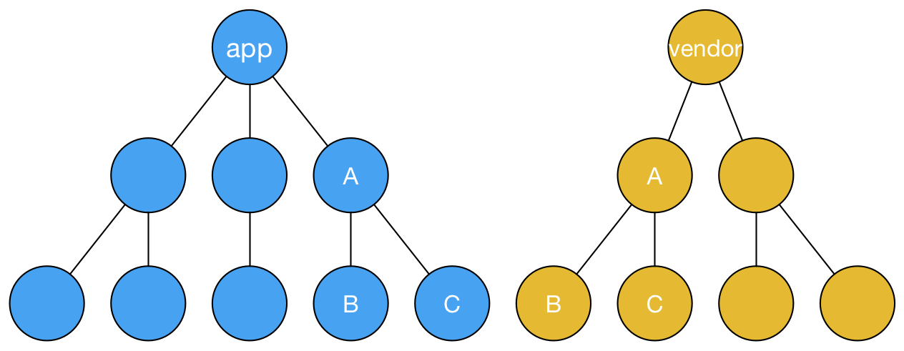

### 拆分生成文件

目前为止我们只有一个js文件，如果依赖文件更新，则需要整个应用更新。

#### 设置vendor输出

为`react`单独添加一个`entry`属性`vendor`

```js
...

const common = {
  entry: {
    app: PATHS.app,
    vendor: ['react']
    // app: PATHS.app
  },
  output: {
    path: PATHS.build,
    filename: '[name].js'
  },
  plugins: [
    new HtmlWebpackPlugin({
      title: 'Webpack demo'
    })
  ]
};

...
```
```sh
[webpack-validator] Config is valid.
Hash: 6b55239dc87e2ae8efd6
Version: webpack 1.13.0
Time: 4168ms
        Asset       Size  Chunks             Chunk Names
       app.js    25.4 kB       0  [emitted]  app
    vendor.js    21.6 kB       1  [emitted]  vendor
   app.js.map     307 kB       0  [emitted]  app
vendor.js.map     277 kB       1  [emitted]  vendor
   index.html  190 bytes          [emitted]
   [0] ./app/index.js 123 bytes {0} [built]
   [0] multi vendor 28 bytes {1} [built]
  [36] ./app/component.js 136 bytes {0} [built]
    + 35 hidden modules
Child html-webpack-plugin for "index.html":
        + 3 hidden modules
```
>app.js并没有小，因为app和vendor之间相同部分并没有合并
>如图

#### 通过CommonsChunkPlugin插件设置

它是一个功能强大的插件，这里只是介绍基础的用法。[更多设置](https://webpack.github.io/docs/list-of-plugins.html#commonschunkplugin)

这里需要额外生成一个`manifest`文件，它能保证webpack在编译时候不去重新编译vendor部分内容。因为如果没有manifest，代码变化会引起hash值变化，vendor里的hash变化就会导致重新编译。

```js
// libs/parts.js
...
exports.extractBundle = function(options) {
  const entry = {};
  entry[options.name] = options.entries;
  return {
    // 定义需要分离的entry，会合并到webpack.config.js中
    entry: entry,
    plugins: [
      new webpack.optimize.CommonsChunkPlugin({
        names: [options.name, 'manifest']
      })
    ]
  };
}
```
>还有[manifest插件](https://github.com/diurnalist/chunk-manifest-webpack-plugin)

```js
// webpack.config.js
...
const common = {
  entry: {
    app: PATHS.app
    // vendor: ['react']
  },
 ...
};
...
// Detect how npm is run and branch based on that
switch(process.env.npm_lifecycle_event) {
  case 'build':
    config = merge(
      common,
	   ...
      parts.extractBundle({
        name: 'vendor',
        entries: ['react']
      }),
      parts.minify(),
      parts.setupCSS(PATHS.style)
    );
    break;
  default:
    ...
}
module.exports = validate(config);
```
执行结果

```sh
[webpack-validator] Config is valid.
Hash: 516a574ca6ee19e87209
Version: webpack 1.13.0
Time: 2568ms
          Asset       Size  Chunks             Chunk Names
         app.js    3.94 kB    0, 2  [emitted]  app
      vendor.js    21.4 kB    1, 2  [emitted]  vendor
    manifest.js  780 bytes       2  [emitted]  manifest
     app.js.map    30.7 kB    0, 2  [emitted]  app
  vendor.js.map     274 kB    1, 2  [emitted]  vendor
manifest.js.map    8.72 kB       2  [emitted]  manifest
     index.html  225 bytes          [emitted]
   [0] ./app/index.js 123 bytes {0} [built]
   [0] multi vendor 28 bytes {1} [built]
  [36] ./app/component.js 136 bytes {0} [built]
    + 35 hidden modules
Child html-webpack-plugin for "index.html":
        + 3 hidden modules
```
>可以看到app.js明显小了，因为相同部分被合并到了一起，
>如图：
>通过`require.ensure`可以实现动态加载依赖

#### 自动加载依赖到vendor

如果在`package.json`里已经严格区分了`dependencies`和`devDependencies`，那就可以通过vendor自动加载相关`dependencies`的依赖。

```js
...
const pkg = require('./package.json');
...
const common = {
  entry: {
    app: PATHS.app,
    vendor: Object.keys(pkg.dependencies)
  },
  ...
}
...
```
>当然可以配置`filter`排除不需要的依赖

------


[`<<上一节:设置环境变量`](./Setting-Environment-Variables.md)
[`>>下一节:为文件名添加hash`](./Adding-Hashes-to-Filenames.md)
